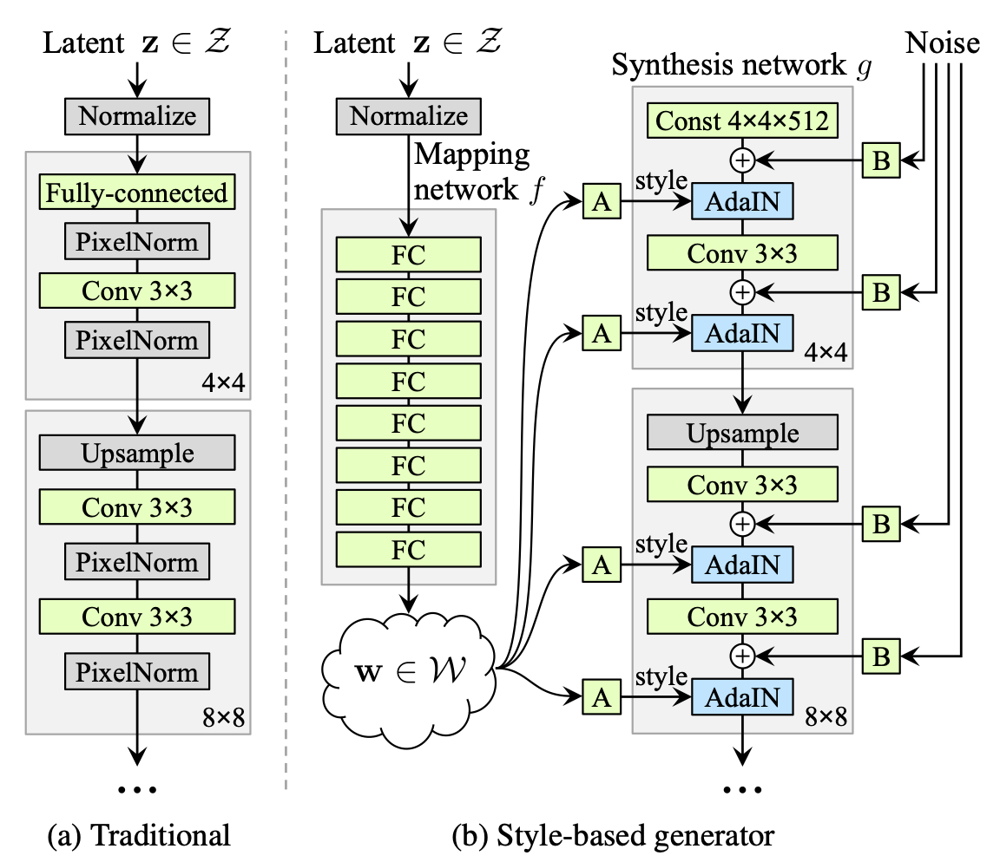
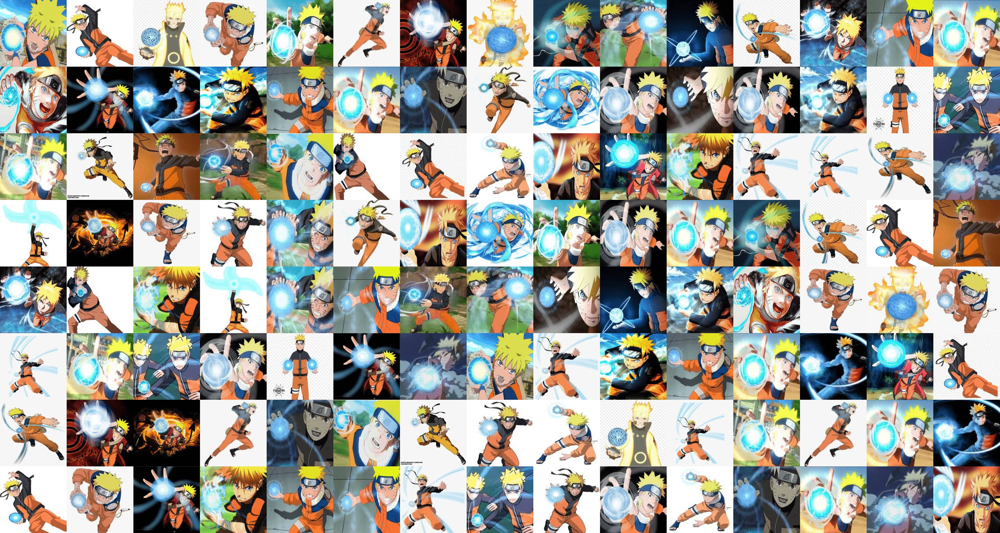
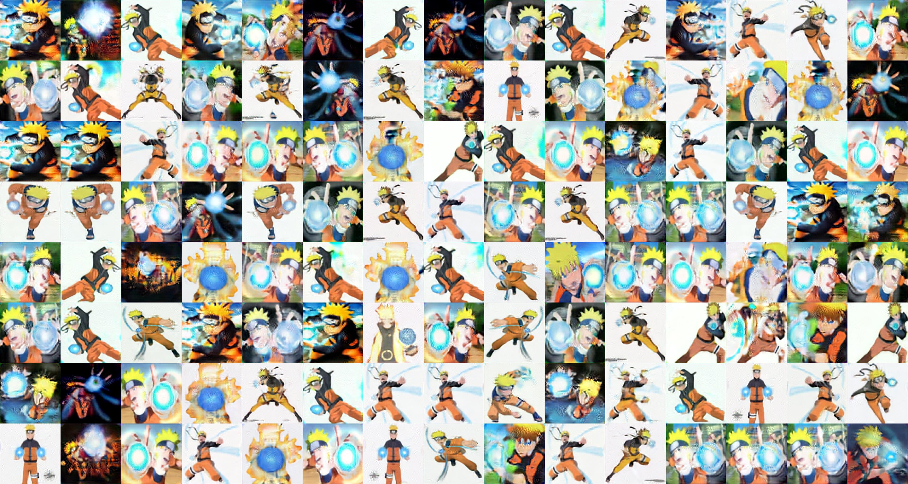

# rasenGAN
Training StyleGAN network to generate Narutos using the rasengan

## Intro to StyleGAN

The Style Generative Adversarial Network, or StyleGAN for short, is an extension to the GAN architecture that proposes large changes to the generator model, including the use of a mapping network to map points in latent space to an intermediate latent space, the use of the intermediate latent space to control style at each point in the generator model, and the introduction to noise as a source of variation at each point in the generator model.

  

More details can be found in the [paper](https://arxiv.org/pdf/1812.04948.pdf) and in the official tensoflow implementation [here](https://github.com/NVlabs/stylegan)

## Instructions of use

The training and generating has been done in [Google Colab](https://colab.research.google.com), so no environment setup and installations are required. Simply upload the .ipynb file from the repo to your google drive account and open it via Colab.

Upload the dataset you want to train or the pretrained model to your drive and follow instructions given in the Colab file itself.

Use the model weights from [here](https://drive.google.com/file/d/1d2RHh70XdFFkl3Vy8l9lWWX5vZfRN5bq/view?usp=sharing) and the inception features from [here](https://drive.google.com/file/d/15VZ72phXJ_7lxBtn8aaXdNG-1IZQlJ5U/view?usp=sharing)

## Results

The dataset consists of images of naruto using his favourite jutsu rasengan taken from the net. These images were cropped and resized to 256x256 dimension. The model was then trained in the format as suggested in the official implementation. After about 35-40 hours of training, the generated images started looking realistic. Further training would definitely help improving upon the resolution.

     
  This is a gif visualising the changes in generated rasengans drom the beginning.

   
  In the left image are some real images from the dataset. In the right are some generated images.

